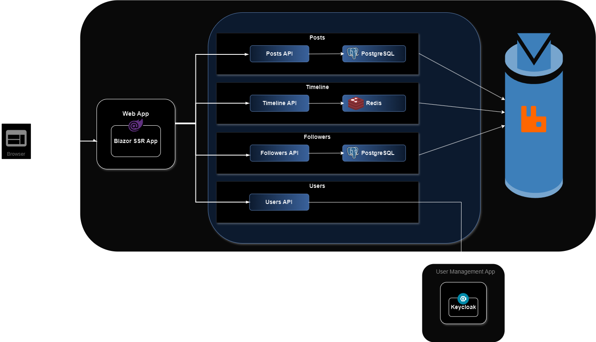

# Pulse

A demo application of a microblogging platform built using HTMX, .Net 8 and Blazor SSR. Any resemblance to any recently renamed single letter platforms is purely coincidental.

# Layout
## Modules
The Modules directory encapsulates the business logic, divided into distinct domains such as Followers, Posts, Search, Timeline, and Users. Each module is structured to maintain a separation of concerns, including:

- **Contracts**: Defines interfaces and data contracts used across the module, anything that needs to be referenced externally.
- **Domain**: Contains the core logic, including API endpoints, data models, services, and domain-specific processing. *Everything in here should be internal to the module and not referenced elsewhere*
- **Test**: Houses unit and integration tests for the module.
- **UI**: Includes Blazor components and pages relevant to the module, pure UI components and also API responses.

### Key Components:
- **Contracts/Services**: Services interfaces for use in other modules.
- **Domain/Api/Endpoints**: API endpoints, minimal apis using the REPR pattern.
- **Domain/Data**: Entity Framework Core models and data access logic.
- **Domain/Services**: Implementation of business logic.
- **UI/Components**: Blazor components for the module's UI.
- **UI/wwwroot**: Static assets specific to the module, like CSS, JavaScript, and images.

## Pulse.Shared
The Pulse.Shared directory contains common functionalities used across multiple modules:

- **Auth**: Authentication and authorization utilities.
- **Data**: Shared data access components and utilities.
- **Domain**: Shared domain entities and logic.
- **Extensions**: Extension methods for various types and services.
- Pretty much anything else that doesn't belong to one single module

## Pulse.Shared.UI
As the name suggests, shared UI that doesn't belong to one particular module

- **Components**: Global reusable Blazor components.
- **wwwroot**: Shared static assets like stylesheets and scripts.

## Pulse.WebApp
The main entry point of the application, Pulse.WebApp, orchestrates the integration of all modules and shared components:

- **Client**: Blazor components and pages for the client-side application.
- **Configuration**: Application configuration files and settings.
- **wwwroot**: Global static assets for the entire application.

## Development Practices
- **Modular Design**: Each module can be developed, tested, facilitating a microservices-like approach within a monolithic application, modules should own thier own data and shouldn't touch each others internals.
- **Shared Code**: Common functionalities are abstracted into shared libraries.
- **Blazor SSR**: Utilizes server-side rendering for Blazor components, don't go using Web Assembly or Server Side Blazor.
- **HTMX**: Use HTMX for anything to do with server state, any client state should be handled using Alpine or Vanilla JS.